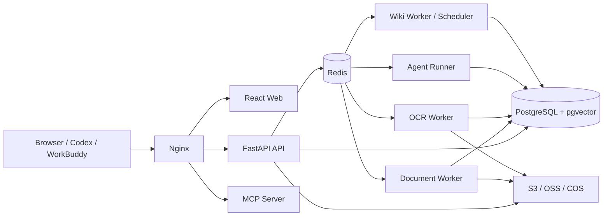

<p align="center">
  
</p>

<h1 align="center">SynapseKB</h1>

<p align="center">
  A private, time-aware, source-grounded knowledge base for individuals and small teams
</p>

<p align="center">
  <a href="README.md">简体中文</a> · <a href="README.en.md">English</a>
</p>

<p align="center">
  <a href="LICENSE"></a>
  
  
  
  
</p>

SynapseKB brings document ingestion, OCR, temporal hybrid retrieval, RAG, bounded knowledge-analysis
agents, maintainable Wikis, temporal relationship graphs, and MCP/Skill integration into one private
deployment. It deliberately focuses on a complete workflow for stable business environments rather
than becoming a universal data connector: **ingest documents → build indexes → answer with evidence →
curate a Wiki → safely expose knowledge to external AI tools**.

> [!IMPORTANT]
> This is an early, runnable open-source release. The core vertical workflows are implemented, but the
> API, database schema, and UI may still evolve. Benchmark with representative data, review security,
> and rehearse backup and recovery before production use.

## Why SynapseKB

- **Time is a first-class retrieval constraint.** `source_time`, `created_at`, and `updated_at` are
  applied inside both keyword and vector candidate SQL, not after retrieving an unfiltered Top-K.
- **Every important claim can lead back to evidence.** Answers retain document names, pages, sections,
  original text, and source timestamps, with links back to the document.
- **Knowledge agents have explicit boundaries.** They read only authorized SynapseKB data and cannot
  browse the web, execute Shell/Python, control a browser, or mutate external systems.
- **The Wiki is a maintainable knowledge layer.** Markdown is the node content source of truth, while
  relationships, provenance, versions, and merge records remain independently auditable.
- **Private deployment is the default.** Authorization, PAT scopes, file access, and knowledge-base
  filters are enforced server-side. Credentials are encrypted and redacted from normal logs.
- **A modular monolith, not a microservice collection.** Domain and permission rules stay shared;
  separate processes exist only for long-running or independently scalable workloads.

## Features

| Area | Implemented capabilities |
| --- | --- |
| Document knowledge bases | PDF, scanned PDF, images, DOCX, XLSX, PPTX, Markdown, TXT, HTML, and web URLs; hash deduplication, tags, preview, retry, cancellation, and reprocessing |
| OCR and parsing | Local parsing for regular documents; PaddleOCR cloud tasks for images and low-text-density PDFs; persisted pages, Markdown, table text, and job state |
| Retrieval and RAG | pgvector search, Chinese keyword search, RRF hybrid recall, optional reranking, structured temporal filters, SSE answers, and citations |
| Knowledge-analysis Agent | LangGraph state, internal read-only tools, temporal interpretation, independent period comparison, persistence, cancellation, timeouts, history, and citations |
| Wiki | Per-KB Wiki spaces, Markdown nodes, provenance and backlinks, version history, atomic publishing, incremental updates, health checks, reversible entity merges |
| Temporal graph | Page, document, and topic nodes/edges; local subgraphs, type and time filters, relationship evidence, and page navigation |
| MCP and Skills | Remote Streamable HTTP MCP, bearer PATs, scopes, auditing, a stdio proxy, and four Codex/WorkBuddy Skills |
| Administration and security | Admin/user roles, KB and Agent grants, per-module model configuration, runtime OCR/storage settings, task center, auditing, and rate limiting |

### Document format notes

- Scanned PDFs and `JPG/JPEG/PNG/TIFF` images require PaddleOCR configuration.
- DOCX extracts paragraphs and headings; PPTX extracts text per slide; XLSX extracts cell values by
  worksheet and row.
- URL import fetches only server-visible HTML, PDF, or text. It does not execute JavaScript and applies
  SSRF validation to every redirect.
- Office parsing targets searchable text rather than full visual fidelity or every embedded object.

## Architecture



The API handles short requests, authentication, and authorization. Dramatiq workers handle parsing,
OCR, embeddings, Wiki jobs, and knowledge-base cleanup. Low-frequency cleanup runs on a separate
maintenance queue consumed by the Document Worker. The Agent Runner executes LangGraph workflows. PostgreSQL stores
business truth and vectors; Redis provides queues, events, cancellation signals, and rate limits. See
the [architecture document](docs/architecture.md) for the detailed decisions.

## Technology stack

| Layer | Technologies |
| --- | --- |
| Backend | Python 3.12, FastAPI, Pydantic, SQLAlchemy 2, Alembic, asyncpg, Dramatiq, LangGraph |
| Data | PostgreSQL 16, pgvector, Redis, S3-compatible storage, Alibaba Cloud OSS, Tencent Cloud COS |
| AI | OpenAI-compatible Chat / Embedding / Rerank, DeepSeek, DashScope, Ollama, PaddleOCR Cloud |
| Frontend | React 19, TypeScript, Vite, TanStack Query, Zustand, Tailwind CSS, Radix UI, Cytoscape.js |
| Engineering | Docker Compose, Nginx, structlog, OpenTelemetry, pytest, Vitest, Playwright |

## Quick start

### 1. Prerequisites

The Docker workflow requires only Docker Engine and Docker Compose V2. Source development also
requires Python 3.12, `uv`, Node.js 22+, and pnpm.

```bash
git clone https://github.com/hxj8059/SynapseKB.git
cd SynapseKB
cp .env.example .env
```

The sample values work for local development, but you should at least replace `POSTGRES_PASSWORD`
and `JWT_SECRET`. Generate secure values with:

```bash
openssl rand -hex 32
openssl rand -base64 32 | tr '+/' '-_'
```

The first value can be used as `JWT_SECRET`; the second can be used as
`CREDENTIAL_MASTER_KEY`. Once the master key encrypts model, OCR, or storage credentials, it must be
retained permanently.

### 2. Start the stack

```bash
docker compose up -d --build
docker compose ps
```

Default endpoints:

- Web: <http://localhost:8088>
- OpenAPI: <http://localhost:8088/api/docs>
- Health: <http://localhost:8088/api/v1/health>
- Remote MCP: <http://localhost:8088/mcp>

The API automatically applies Alembic migrations on first startup.

### 3. Create the first administrator

```bash
docker compose exec api synapsekb-admin \
  --email admin@example.com \
  --name Administrator
```

The command securely prompts for and confirms the password. There is no `create` subcommand. Never
place the password in the command line or `.env`.

### 4. Finish initial setup

After signing in:

1. Add and test Chat, Embedding, and optional Rerank models under **Model Settings**.
2. Configure PaddleOCR and run a real-file test if scanned documents are required.
3. Keep local storage for development, or configure OSS, COS, or S3 under **Object Storage**.
4. Create a knowledge base, selecting its fixed Embedding model/dimension and RAG/Wiki models.
5. Upload documents and smoke-test retrieval, RAG, Agent, and Wiki after processing completes.

> [!WARNING]
> The default `.env.example` uses `development`, HTTP, and local storage. It is for local evaluation
> only. Exposing the default Compose stack to the internet is not a production deployment. Production
> should use HTTPS. If only a public IP is currently available, explicitly enable the restricted HTTP
> compatibility mode and still configure strong secrets, exact host/origin allowlists, cloud object
> storage, database backups, and least-privilege network rules. See
> [Deployment and upgrades](docs/deployment.md).

## Model and storage configuration

SynapseKB uses a unified OpenAI-compatible adapter while storing Chat, Embedding, and Rerank models
separately. Knowledge bases and Agents can bind different models to different modules. An Embedding
model and dimension are fixed when a knowledge base is created, preventing mismatches between stored
and query vectors.

Model API keys, PaddleOCR tokens, and object-storage credentials are encrypted in PostgreSQL with an
AES-GCM key derived from `CREDENTIAL_MASTER_KEY`; management APIs never return plaintext secrets.
Infrastructure URLs, CORS, trusted hosts, and other boot-time settings remain in `.env`.

- [Model configuration and compatibility](docs/models.md)
- [PaddleOCR configuration](docs/paddleocr.md)
- [Object storage configuration](docs/object-storage.md)

## MCP, REST API, and Skills

Users can create Personal Access Tokens that are shown once and stored only as hashes. Default read
scopes never expand the user's existing knowledge-base permissions.

Remote Streamable HTTP MCP example:

```json
{
  "mcpServers": {
    "synapsekb": {
      "url": "https://synapsekb.example.com/mcp",
      "headers": {
        "Authorization": "Bearer skbp_..."
      }
    }
  }
}
```

The repository also includes:

- `skills/synapsekb-shared`
- `skills/synapsekb-rag-search`
- `skills/synapsekb-temporal-research`
- `skills/synapsekb-wiki`

Signed-in users can download individual or bundled Skill ZIPs from **Skill Installation** in the app.
The batch-upload REST API accepts a PAT with `document:write`; long Agent MCP calls use the
`start/get/cancel` pattern.

See [MCP and Skill integration](docs/mcp.md) and the [REST API guide](docs/api.md).

## Monorepo layout

```text
apps/
  api/                  FastAPI entry point
  agent_runner/         LangGraph Agent execution
  document_worker/      Parsing, embeddings, and low-frequency maintenance jobs
  ocr_worker/           PaddleOCR cloud polling
  wiki_worker/          Wiki generation, maintenance, and scheduling
  mcp_server/           Remote Streamable HTTP MCP
  mcp_stdio_proxy/      Local stdio-to-remote proxy
  web/                  React Web
packages/synapsekb/     Shared domain, database, auth, retrieval, Agent, Wiki, storage, and model code
skills/                 Codex / WorkBuddy Skill packages
migrations/             Alembic database migrations
tests/                  unit / integration / e2e / load
deploy/                 Docker and Nginx configuration
docs/                   Architecture, API, security, deployment, and operations documentation
```

## Development

Backend:

```bash
uv sync --all-groups
uv run alembic upgrade head
uv run uvicorn apps.api.main:app --reload
```

Frontend:

```bash
pnpm --dir apps/web install --frozen-lockfile
pnpm --dir apps/web dev
```

Common checks:

```bash
uv run ruff check .
uv run mypy packages apps
uv run pytest
pnpm --dir apps/web test
pnpm --dir apps/web build
```

PostgreSQL + pgvector integration tests require Docker:

```bash
RUN_DOCKER_TESTS=1 uv run pytest -m integration
```

## Updating an existing deployment

Back up PostgreSQL, object storage, and the master key before upgrading. Then update the code, build
images, and apply migrations explicitly:

```bash
mkdir -p backups
docker compose exec -T postgres sh -c \
  'pg_dump -U "$POSTGRES_USER" -d "$POSTGRES_DB" --format=custom' \
  > "backups/synapsekb-before-update-$(date +%Y%m%d-%H%M%S).dump"

git pull --ff-only
docker compose build api web
docker compose run --rm api alembic upgrade head
docker compose up -d --remove-orphans
docker compose exec api alembic current
curl -f http://127.0.0.1:8088/api/v1/health
```

Do not run `docker compose down -v` or `docker system prune --volumes`. Do not overwrite an existing
`.env` with a new `.env.example`, and never rotate `CREDENTIAL_MASTER_KEY` during a routine upgrade.
See [Deployment and upgrades](docs/deployment.md) and [Backup and recovery](docs/backup-and-restore.md)
for the complete rollback and acceptance procedure.

## Documentation

| Document | Contents |
| --- | --- |
| [Architecture](docs/architecture.md) | Component boundaries, data flows, retrieval, Agent, Wiki, and MCP decisions |
| [Data model](docs/data-model.md) | Core tables, temporal fields, and indexes |
| [API guide](docs/api.md) | JWT/PAT, uploads, retrieval, SSE, Agent, and Wiki APIs |
| [Model configuration](docs/models.md) | Module binding, provider compatibility, testing, and observability |
| [Deployment and upgrades](docs/deployment.md) | Production baseline, HTTPS, migrations, and upgrades |
| [Backup and recovery](docs/backup-and-restore.md) | PostgreSQL, object storage, and master-key recovery |
| [Security model](docs/security.md) | Authorization, tokens, SSRF, uploads, and logging security |
| [Testing](docs/testing.md) | Unit, integration, E2E, and load tests |
| [Known limitations and roadmap](docs/roadmap.md) | Current boundaries and planned work |

The detailed documents are currently written in Chinese; this English README covers the main setup,
architecture, and operating model.

## Security

- Never commit `.env`, database dumps, real documents, access tokens, or cloud/API credentials.
- Public deployments should use HTTPS. Public-IP HTTP is an explicit compatibility mode only; HTTP
  model gateways are acceptable only inside a trusted VPC.
- PATs are displayed once; API keys are encrypted; normal logs exclude full documents, prompts, and
  secrets.
- Do not include exploit details, real data, or credentials in public issues. Prefer a private GitHub
  Security Advisory for vulnerability reports.

See the [security model](docs/security.md).

## Contributing

Issues, design discussions, and pull requests are welcome. Before implementing a substantial change,
please read the architecture and roadmap and follow these principles:

1. Server-side authorization must never depend only on hidden UI controls.
2. Temporal filters must enter both keyword and vector candidate queries.
3. External model/OCR calls may be mocked in tests, but product paths must not present static fake data
   as completed work.
4. New features require tests, migration notes, and relevant documentation.
5. Avoid multi-tenancy, microservices, or configuration complexity that does not match the target scale.

Run the backend checks and frontend tests/build before submitting. For larger features, open an issue
first describing the use case, boundaries, and data migration plan.

## Acknowledgements

SynapseKB's Wiki design is inspired by Andrej Karpathy's
[LLM Wiki](https://gist.github.com/karpathy/442a6bf555914893e9891c11519de94f),
particularly the idea of an evolving knowledge layer built from Markdown nodes, explicit relationships,
`index`, `log`, and continuous maintenance. SynapseKB adapts these ideas to private knowledge bases
with provenance, temporal relationships, versioned publishing, entity resolution, health checks, and
reversible merges.

Thanks to the FastAPI, PostgreSQL/pgvector, LangGraph, Dramatiq, React, MCP, PaddleOCR, and broader
open-source communities.

## License

SynapseKB is released under the [MIT License](LICENSE).
