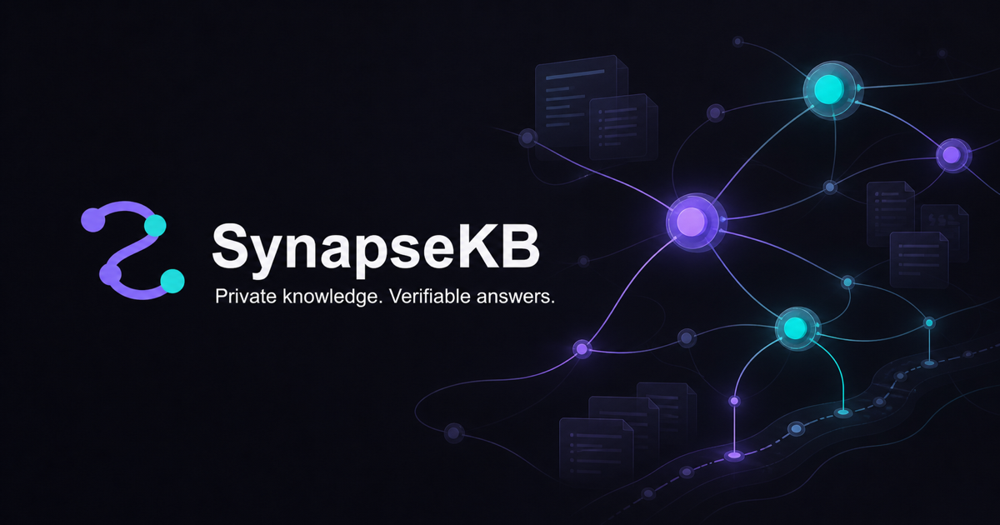
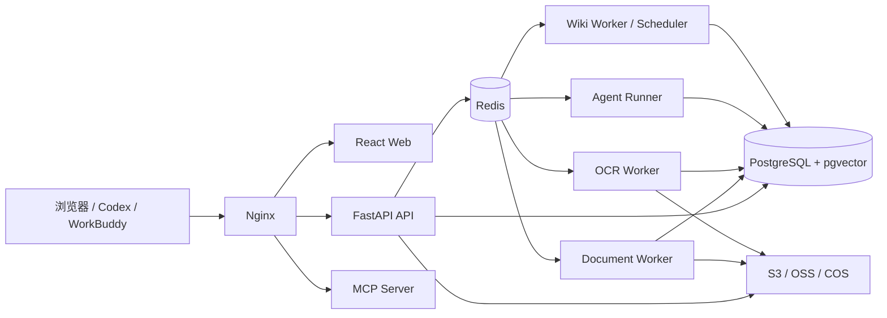

<p align="center">
  
</p>

<h1 align="center">SynapseKB（触智）</h1>

<p align="center">
  面向个人与中小团队的私有、时间感知、可溯源智能知识库
</p>

<p align="center">
  <a href="README.md">简体中文</a> · <a href="README.en.md">English</a>
</p>

<p align="center">
  <a href="LICENSE"></a>
  
  
  
  
</p>

SynapseKB 将文档接入、OCR、时间化混合检索、RAG 问答、受限知识分析 Agent、可维护
Wiki、时间关系图和 MCP/Skill 集成放在一个清晰的私有部署产品中。它不追求连接所有外部
数据源，而是专注于固定业务环境中的完整闭环：**导入资料 → 建立索引 → 基于证据回答 →
沉淀 Wiki → 向外部 AI 工具安全提供知识**。

> [!IMPORTANT]
> 当前版本是可运行的早期开源版本。核心纵向链路已经实现，但 API、数据库结构和 UI 仍
> 可能演进。生产使用前请完成真实数据压测、安全审查、备份恢复演练和云厂商兼容验证。

## 为什么选择 SynapseKB

- **时间是一等检索条件**：`source_time`、`created_at`、`updated_at` 直接进入关键词与
  向量候选 SQL，而不是召回后再由 Python 丢弃结果。
- **每个结论都能回到原文**：答案保留文档、页码、章节、原始文本和来源时间，支持点击定位。
- **知识 Agent 有明确边界**：只读取已授权的 SynapseKB 数据，不联网、不执行 Shell/Python、
  不操作浏览器或外部业务系统。
- **Wiki 是可维护的知识层**：节点以 Markdown 为内容真值，关系、来源、版本和合并记录独立
  保存；生成失败不会覆盖已发布版本。
- **面向私有部署**：服务端统一执行权限、令牌 Scope、文件访问和知识库范围校验；密钥加密
  保存并从日志脱敏。
- **模块化单体，而非微服务堆叠**：共享领域与权限规则，只有长任务和需要独立扩缩容的组件
  使用独立进程。

## 主要能力

| 模块 | 已实现能力 |
| --- | --- |
| 文档知识库 | PDF、扫描 PDF、图片、DOCX、XLSX、PPTX、Markdown、TXT、HTML、网页 URL；Hash 去重、标签、预览、重试、取消、重新解析 |
| OCR 与解析 | 普通文档本地解析；图片和低文本密度 PDF 接入 PaddleOCR 云任务；页码、Markdown、表格文本和任务状态持久化 |
| 检索与 RAG | pgvector 向量检索、中文关键词检索、RRF 混合召回、可选 Rerank、结构化时间过滤、SSE 回答和引用溯源 |
| 知识分析 Agent | LangGraph 状态流转、内部只读工具、时间理解、跨时期独立检索、运行持久化、取消、超时、历史记录和引用 |
| Wiki | 独立 Wiki 空间、节点 Markdown、来源与双链、版本历史、原子发布、增量更新、健康检查、相似节点合并与撤销 |
| 时间关系图 | 页面、文档和主题级节点/边；局部子图加载、节点类型过滤、时间过滤、关系证据和页面跳转 |
| MCP 与 Skill | Remote Streamable HTTP MCP、Bearer PAT、Scope、审计、stdio 代理，以及适用于 Codex/WorkBuddy 的四个 Skill |
| 管理与安全 | 管理员/普通用户、知识库与 Agent 授权、模型分模块配置、OCR/对象存储在线配置、任务中心、审计和限流 |

### 文档格式说明

- 扫描 PDF 与 `JPG/JPEG/PNG/TIFF` 图片需要配置 PaddleOCR。
- DOCX 提取段落和标题；PPTX 按幻灯片提取文本；XLSX 按工作表和行提取单元格值。
- 网页导入只抓取服务端可见的 HTML/PDF/文本，不执行 JavaScript，并对每次重定向执行 SSRF 检查。
- 当前 Office 解析器以文本知识化为目标，不保证还原复杂版式或处理所有嵌入对象。

## 系统架构



API 负责短请求、认证和权限；Dramatiq Worker 负责解析、OCR、Embedding 和 Wiki 长任务；
Agent Runner 负责 LangGraph 执行；PostgreSQL 保存业务真值与向量，Redis 用于队列、事件、
取消信号和限流。更详细的决策见[架构说明](docs/architecture.md)。

## 技术栈

| 层 | 技术 |
| --- | --- |
| 后端 | Python 3.12、FastAPI、Pydantic、SQLAlchemy 2、Alembic、asyncpg、Dramatiq、LangGraph |
| 数据 | PostgreSQL 16、pgvector、Redis、S3-compatible / 阿里云 OSS / 腾讯云 COS |
| AI | OpenAI-compatible Chat / Embedding / Rerank、DeepSeek、DashScope、Ollama、PaddleOCR Cloud |
| 前端 | React 19、TypeScript、Vite、TanStack Query、Zustand、Tailwind CSS、Radix UI、Cytoscape.js |
| 工程 | Docker Compose、Nginx、structlog、OpenTelemetry、pytest、Vitest、Playwright |

## 快速开始

### 1. 准备环境

Docker 方式只需要 Docker Engine 与 Docker Compose V2。源码开发另外需要 Python 3.12、
`uv`、Node.js 22+ 和 pnpm。

```bash
git clone https://github.com/hxj8059/SynapseKB.git
cd SynapseKB
cp .env.example .env
```

开发环境可以使用示例默认值，但建议至少修改 `POSTGRES_PASSWORD` 和 `JWT_SECRET`。生成安全
随机值可使用：

```bash
openssl rand -hex 32
openssl rand -base64 32 | tr '+/' '-_'
```

第一行可用于 `JWT_SECRET`；第二行可用于 `CREDENTIAL_MASTER_KEY`。主密钥一旦用于加密模型、
OCR 或对象存储凭据，就必须长期保留。

### 2. 启动服务

```bash
docker compose up -d --build
docker compose ps
```

默认入口：

- Web：<http://localhost:8088>
- OpenAPI：<http://localhost:8088/api/docs>
- 健康检查：<http://localhost:8088/api/v1/health>
- Remote MCP：<http://localhost:8088/mcp>

API 首次启动会自动执行 Alembic 数据库迁移。

### 3. 创建首个管理员

```bash
docker compose exec api synapsekb-admin \
  --email admin@example.com \
  --name 管理员
```

命令会交互式读取并确认密码，不需要 `create` 子命令，也不要把密码写入命令行或 `.env`。

### 4. 完成初始化

登录后建议按以下顺序配置：

1. 在“模型设置”添加并测试 Chat、Embedding 和可选 Rerank 模型。
2. 如需扫描件解析，在“OCR 设置”配置 PaddleOCR 并执行真实文件测试。
3. 开发环境可继续使用本地存储；生产环境在“对象存储”配置 OSS、COS 或 S3。
4. 创建知识库时确定 Embedding 模型与维度，并绑定 RAG/Wiki 模型。
5. 上传文档，等待任务完成后执行检索、问答、Agent 和 Wiki 冒烟测试。

> [!WARNING]
> 默认 `.env.example` 使用 `development`、HTTP 和本地对象存储，仅适合本机体验。把 Compose
> 直接暴露到公网不等于生产部署。生产推荐使用 HTTPS；暂时只有公网 IP 时，必须显式启用
> 受限的 HTTP 兼容模式，并同时设置强随机密钥、精确 Host/Origin 白名单、云对象存储、数据库
> 备份和最小权限安全组，详见[部署与升级](docs/deployment.md)。

## 模型与存储配置

SynapseKB 使用统一的 OpenAI-compatible 适配层，但 Chat、Embedding、Rerank 分开保存，
并允许知识库或 Agent 为不同模块绑定不同模型。Embedding 模型和维度在知识库创建时锁定，
避免已索引向量与查询维度不一致。

模型 API Key、PaddleOCR Token 和对象存储密钥使用 `CREDENTIAL_MASTER_KEY` 派生的 AES-GCM
密钥加密后写入 PostgreSQL，管理 API 不回传明文。基础设施连接、公开 URL、CORS、Trusted
Host 等启动参数仍由 `.env` 管理。

- [模型配置与兼容说明](docs/models.md)
- [PaddleOCR 配置](docs/paddleocr.md)
- [对象存储配置](docs/object-storage.md)

## MCP、REST API 与 Skills

用户可以在 App 中创建只展示一次、数据库仅保存 Hash 的 Personal Access Token。默认只读
Scope 不会扩大用户原本的知识库权限。

Remote Streamable HTTP MCP 示例：

```json
{
  "mcpServers": {
    "synapsekb": {
      "url": "https://synapsekb.example.com/mcp",
      "headers": {
        "Authorization": "Bearer skbp_..."
      }
    }
  }
}
```

仓库同时提供：

- `skills/synapsekb-shared`
- `skills/synapsekb-rag-search`
- `skills/synapsekb-temporal-research`
- `skills/synapsekb-wiki`

登录页面后也可以从侧栏“Skill 安装”下载独立 ZIP 或合集。批量上传 REST API 可以使用包含
`document:write` 的 PAT；长 Agent MCP 调用使用 `start/get/cancel` 模式。

完整说明见 [MCP 与 Skill 接入](docs/mcp.md)和 [REST API](docs/api.md)。

## Monorepo 结构

```text
apps/
  api/                  FastAPI 入口
  agent_runner/         LangGraph Agent 执行进程
  document_worker/      文档解析、分块与 Embedding
  ocr_worker/           PaddleOCR 云任务轮询
  wiki_worker/          Wiki 生成、维护与调度
  mcp_server/           Remote Streamable HTTP MCP
  mcp_stdio_proxy/      本地 stdio 到远程 API 的代理
  web/                  React Web
packages/synapsekb/     共享领域、数据库、认证、检索、Agent、Wiki、存储与模型代码
skills/                 Codex / WorkBuddy Skill 包
migrations/             Alembic 数据库迁移
tests/                  unit / integration / e2e / load
deploy/                 Docker 与 Nginx 配置
docs/                   架构、API、安全、部署和运维文档
```

## 源码开发

后端：

```bash
uv sync --all-groups
uv run alembic upgrade head
uv run uvicorn apps.api.main:app --reload
```

前端：

```bash
pnpm --dir apps/web install --frozen-lockfile
pnpm --dir apps/web dev
```

常用检查：

```bash
uv run ruff check .
uv run mypy packages apps
uv run pytest
pnpm --dir apps/web test
pnpm --dir apps/web build
```

PostgreSQL + pgvector 集成测试需要 Docker：

```bash
RUN_DOCKER_TESTS=1 uv run pytest -m integration
```

## 更新已有部署

升级前先备份 PostgreSQL、对象存储和主密钥，再更新代码、构建镜像并显式执行迁移：

```bash
mkdir -p backups
docker compose exec -T postgres sh -c \
  'pg_dump -U "$POSTGRES_USER" -d "$POSTGRES_DB" --format=custom' \
  > "backups/synapsekb-before-update-$(date +%Y%m%d-%H%M%S).dump"

git pull --ff-only
docker compose build api web
docker compose run --rm api alembic upgrade head
docker compose up -d --remove-orphans
docker compose exec api alembic current
curl -f http://127.0.0.1:8088/api/v1/health
```

不要使用 `docker compose down -v` 或 `docker system prune --volumes`。不要用新的
`.env.example` 覆盖已有 `.env`，也不要在升级时更换 `CREDENTIAL_MASTER_KEY`。完整回退和
验收流程见[部署与升级](docs/deployment.md)与[备份恢复](docs/backup-and-restore.md)。

## 文档

| 文档 | 内容 |
| --- | --- |
| [架构说明](docs/architecture.md) | 组件边界、数据流、检索、Agent、Wiki 与 MCP 决策 |
| [数据模型](docs/data-model.md) | 核心表、时间字段和索引 |
| [API 说明](docs/api.md) | JWT/PAT、上传、检索、SSE、Agent 和 Wiki API |
| [模型配置](docs/models.md) | 模块绑定、供应商兼容、测试与观测 |
| [部署与升级](docs/deployment.md) | 生产基线、HTTPS、迁移和升级 |
| [备份与恢复](docs/backup-and-restore.md) | PostgreSQL、对象存储和主密钥恢复 |
| [安全模型](docs/security.md) | 权限、令牌、SSRF、上传和日志安全 |
| [测试与验收](docs/testing.md) | 单元、集成、E2E 与负载测试 |
| [已知限制与路线图](docs/roadmap.md) | 当前边界和后续计划 |

## 安全

- 不要提交 `.env`、数据库备份、真实文档、访问令牌或任何云厂商/API 密钥。
- 公开部署应使用 HTTPS；公网 IP + HTTP 仅作为显式兼容模式，HTTP 模型网关只能位于受信
  VPC/内网。
- PAT 只展示一次；API Key 加密存储；普通日志不记录完整文档、Prompt 或密钥。
- 发现安全问题时，请不要在公开 Issue 中附带利用细节、真实数据或密钥；优先使用 GitHub
  Security Advisory 私下报告。

详见[安全模型](docs/security.md)。

## 参与贡献

欢迎提交 Issue、设计讨论和 Pull Request。开始编码前建议先阅读架构与路线图，并遵循以下原则：

1. 服务端权限检查不能只依赖前端隐藏按钮。
2. 时间过滤必须进入关键词和向量候选查询阶段。
3. 外部模型/OCR 可以在测试中 Mock，但产品路径不能用静态假数据冒充完成。
4. 新功能需要测试、迁移说明和必要文档。
5. 不引入与当前规模不匹配的多租户、微服务或配置复杂度。

提交前请运行后端检查和前端测试/构建。较大的功能建议先创建 Issue 说明用例、边界与数据
迁移方案。

## 致谢

SynapseKB 的 Wiki 设计受到 Andrej Karpathy 的
[LLM Wiki](https://gist.github.com/karpathy/442a6bf555914893e9891c11519de94f)
概念启发，尤其是使用 Markdown 节点、显式关系、`index`、`log` 和持续维护机制构建可演进
知识层的思路。SynapseKB 在此基础上结合私有知识库场景，实现了来源溯源、时间关系、版本发布、
实体消歧、健康检查和可撤销合并。

感谢 FastAPI、PostgreSQL/pgvector、LangGraph、Dramatiq、React、MCP、PaddleOCR 及其开源
社区。

## 许可证

本项目使用 [MIT License](LICENSE)。
