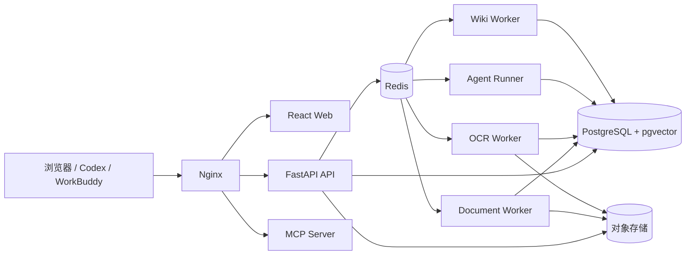

# 系统架构

## 总体决策

SynapseKB 使用“模块化单体 + 独立长任务进程”：

API 不执行长耗时解析或 Agent 循环。各 Worker 可独立设置副本和并发；它们不拥有独立数据库，也不复制业务授权逻辑。

## 关键数据流

### 文档

1. API 验证知识库写权限、文件类型、大小和 Hash。
2. 大文件由浏览器使用临时凭证直传；本地开发可走受限 API 上传。
3. API 记录 `documents` 和唯一 `processing_jobs`，再投递 Dramatiq。
4. Worker 使用数据库状态和幂等键抢占任务；每个阶段前检查取消标记。
5. 解析/OCR 结果先写暂存状态，Embedding 成功后在事务内替换活动 Chunk。
6. 文档变为 `ready` 后才可检索，并触发 Wiki 影响事件。

### 检索

向量和关键词分支共享同一个 SQL 过滤表达式。知识库、文档、标签、权限和时间条件进入各自候选 CTE；不会先取全库 TopK 再由 Python 丢弃。两路结果用 RRF 合并，可选 Rerank。

### Agent

LangGraph 只注册 SynapseKB 内部只读工具。工具调用进入同一应用服务，因此不会绕过 App 权限。Redis Streams 只保存可展示事件；运行状态和步骤真值在 PostgreSQL。

### Wiki

生成版本与当前发布版本分离。候选页面先落库但不可见；全部页面与引用通过检查后，
页面当前版本指针、空间 `published_version` 和受影响关系图才在同一数据库事务中
切换。失败或取消不会改变当前页面或当前关系图。

Wiki 节点以 Markdown 页面作为内容真值，关系边单独存 PostgreSQL，页面内的“双链”
由边反向查询得到。`index.md` 从当前发布页面实时生成；`log.md` 从 Wiki 更新与健康任务
的追加记录生成，避免维护易过期的重复文件。

Wiki 增量生成采用分层实体消歧，而不是把全量历史目录塞入上下文：规范化标题和持久
别名先做精确命中；文档标题与少量正文生成查询向量，从当前 Wiki 只召回最多 16 个
历史节点；模型只能从这份候选中填写 `existing_page_id`；生成结果再经过一次精确别名
校验。Embedding 只表示主题相关性，不能单独作为“同一实体”的合并依据。这样上下文
大小不随节点总数线性增长，也不会把同赛道公司或同类产品自动当成重复节点。

生成和健康检查共用一份实体同一性规则：只有中英文名、正式名/简称、明确缩写、拼写
变体和不改变定义边界的观察范围后缀可以合并。系列、世代、版本、型号和配置始终分开；
例如 `DeepSeek`、`DeepSeek V3`、`DeepSeek V4` 是三个节点，通过 `version_of` 连接。
上位类别与下位产品、通用事物与特定应用、集团与子公司也保持不同节点。价格变化、
受益标的、产能扩张等状态不是稳定实体，应进入核心节点 Markdown 或成为有来源的关系。
共享缩写但括号释义冲突时必须判为不同实体。

独立 Wiki Scheduler 按知识库配置触发健康检查。相似实体候选以名称 trigram 和历史
别名重合为入口，再由所选 Wiki Chat 模型给出同一/相关/不同建议；孤立页面只携带各自
最多 4 个局部邻居供模型判断，不传全量页面目录。模型失败时粗候选仍展示给管理员，
不会形成“发现了候选但无操作入口”的死角。管理员可选择主节点合并，也可持久标记为
不同实体，后续检查不再重复提示。

缺失节点与完全重复边可自动修复。健康模型置信度达到 0.90 且给出可审计同一性依据时，
系统自动合并；高置信 `related/distinct` 会持久记为不同实体，避免下次重复复核。低置信
结论和关系新增仍由管理员确认。即使模型建议合并，代码也会拒绝名称中版本、型号或配置
标记不同的页面。对于状态、阶段、观点和组合观察等不合格页面，模型可使用 `fold_into`
把 Markdown、来源和关系归并到稳定核心页后归档来源页；该动作不声称两个标题是同义词，
也不能用于把具体产品版本归入产品系列。合并或归并会
创建目标 Markdown 新版本，按来源页面建立可审计章节并去掉完全重复正文；页面来源、
保护区块和关系元数据一并合并，图边重连并去重。来源页面只标记为已归档并设置
`merged_into_page_id`，页面版本不会物理删除；来源名称和别名转移到主节点供后续复用。
确认合并时还会保存结构化快照。只要目标页在合并后没有再次修改，管理员可以一键撤销，
事务内恢复目标版本指针、来源页面、来源节点、原别名和原关系边；目标页已有后续编辑时
拒绝自动撤销，避免静默覆盖新内容。

### MCP

PAT 解析出用户和 Scope 后，MCP 工具调用现有应用服务。Scope 是额外限制，不会扩大用户在 App 中的知识库权限。

## 扩展与性能

- PostgreSQL HNSW 向量索引；时间/知识库组合 B-tree；标签关联表索引；全文字段 GIN。
- 候选过采样只发生在已经过滤后的数据集。
- 模型与 OCR 按配置的最大并发使用 Redis 做跨进程配额。
- 对象存储保存原件、页面资产和导出；数据库只保存元数据与稳定对象键。
- 关系图 API 强制中心节点/搜索条件、跳数和节点上限，禁止全图加载。

## 可观测性

所有请求携带 request ID。structlog 输出 JSON；启用 OTLP 后，OpenTelemetry
记录 HTTP 请求 Span。模型、OCR 和任务阶段通过结构化事件记录耗时与错误，后续
可以按部署需要继续增加 SQL/Redis 自动埋点。敏感字段与文档全文不进入普通日志。
